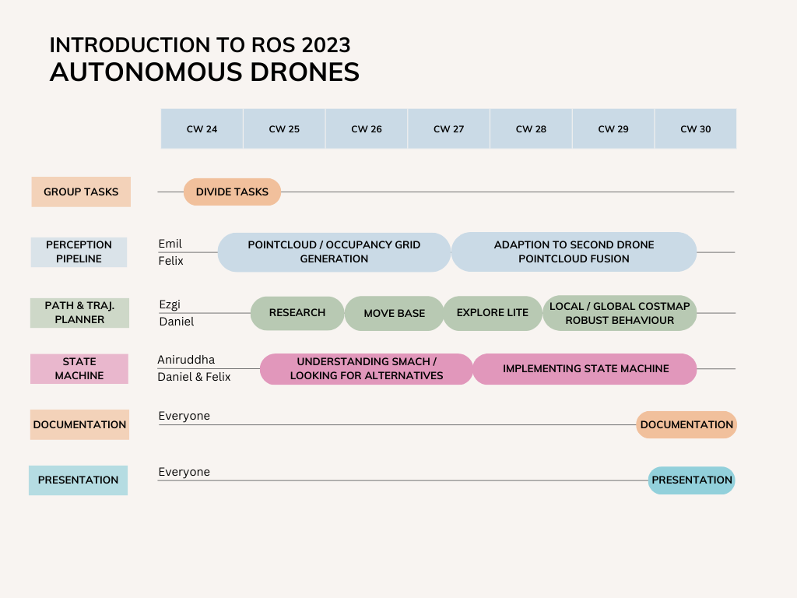

# intro2ros-autonomous-drones


## Description

The main goal of this project is finding an efficient solution to create a 2D map of an unknown environment.

Two drones compute their targets and required trajectories autonomously and merge the depth information of their respective cameras into a global 3D occupancy grid and 2D map.

IMPORTANT NOTICE:
The unity simulation and some files, as denoted by the documentation, were kindly provided by [Prof. Dr. Markus Ryll](https://campus.tum.de/tumonline/visitenkarte.show_vcard?pPersonenId=DB1692F4C0753CDB&pPersonenGruppe=3).


## Team members

- Daniel Brunner
- Ezgi Köse
- Aniruddha Mallick
- Felix Waiblinger
- Emil Zahlbaum


## Time line




## Installation / Usage

Note: This project has been setup and tested under Ubuntu 20.04 LTS, ROS noetic and Python3 being installed on our system.

1. Download / clone this repository

    ```
    git clone https://gitlab.lrz.de/ge73kib/intro2ros-autonomous-drones.git
    ```

2. Install required ROS packages

    ```
    sudo apt-get install ros-noetic-octomap ros-noetic-octomap-mapping ros-noetic-move-base
    ```

3. Build the project workspace

    ```
    cd intro2ros-autonomous-drones/code
    catkin build
    source devel/setup.bash
    ```

4. Download pre-built simulation files from https://syncandshare.lrz.de/getlink/fiEg9ocZ6Pc5iuEa4QqN1b/ (link provided by Markus Ryll)

5. Move the files into *devel/lib/simulation* and make the simulation executable

    ```
    chmod +x devel/lib/simulation/Two_Drones.x86_64
    ```

6. Run the simulation

    ```
    roslaunch simulation simulation.launch
    ```

For more information on the required packages, feel free to visit [depth_image_proc](http://wiki.ros.org/depth_image_proc), [octomap](http://wiki.ros.org/octomap), [octomap_mapping](http://wiki.ros.org/octomap_mapping?distro=noetic), [move_base](http://wiki.ros.org/move_base) and [explore_lite](http://wiki.ros.org/explore_lite).


## Documentation

Detailed documentation can be found [here](documentation/documentation.md).


## Troubleshooting

If you encounter any problems during installation, building or launching the project, please make sure...

- to have the correct packages installed
- catkin tools might require additional packages like *python3-catkin-tools*
- the workspace is correctly extended (```catkin config --extend /opt/ros/noetic```)
- ros dependencies are updated (```rosdep init && rosdep update```)
- to have sourced the correct setup file (```source intro2ros-autonomous-drones/code/devel/setup.bash```)
- to consider to restart the simulation if one or both drones get stuck before the map is fully explored
- to have the goddess of fortune on your side, guiding the cmake build system on its twisted path...
