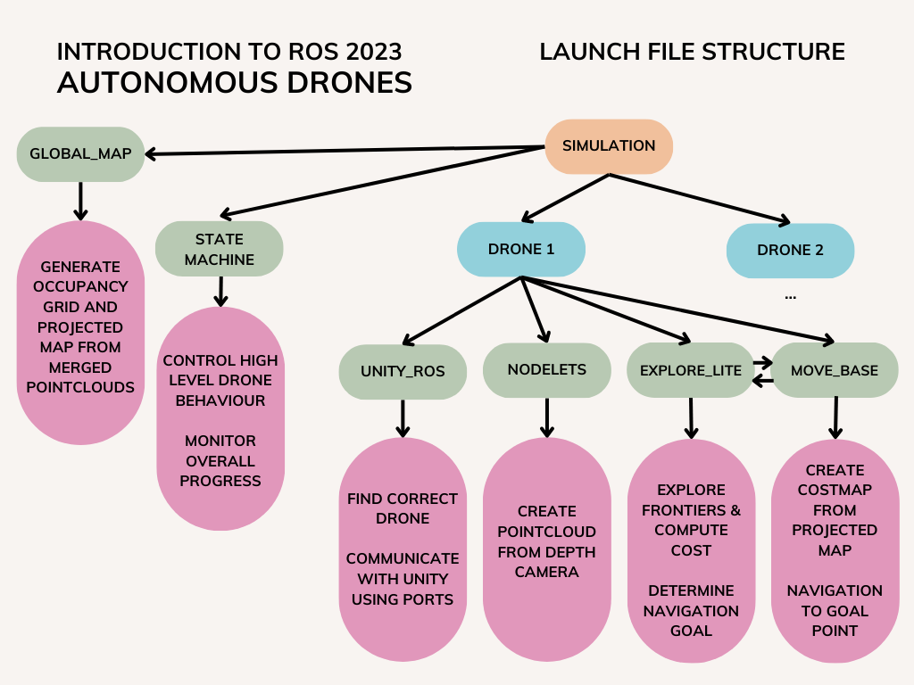
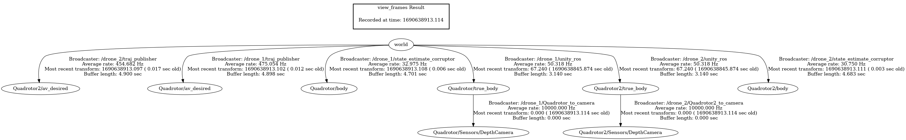
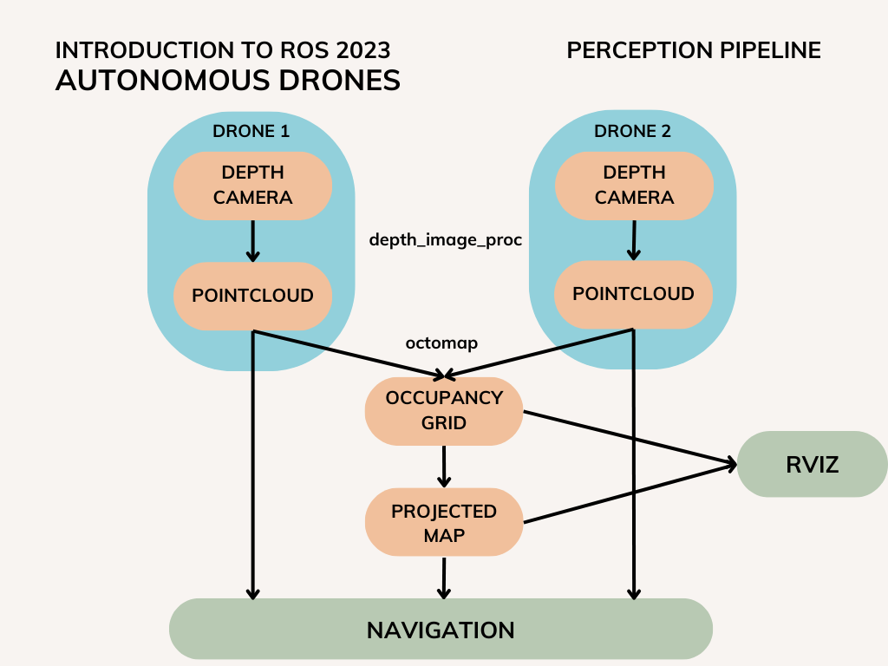
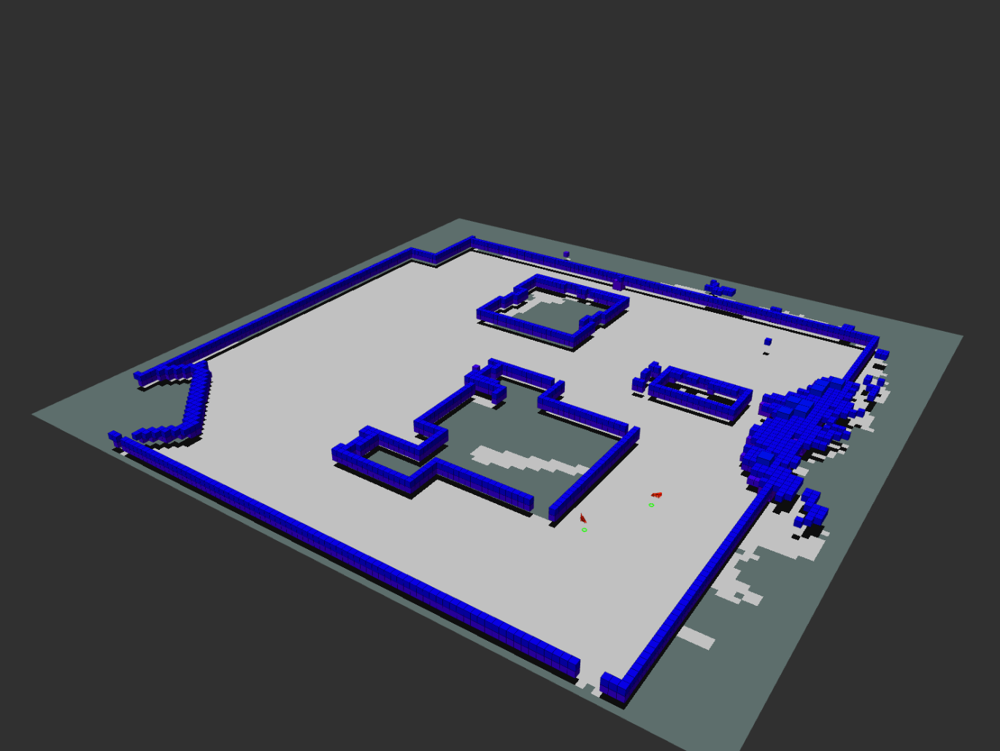
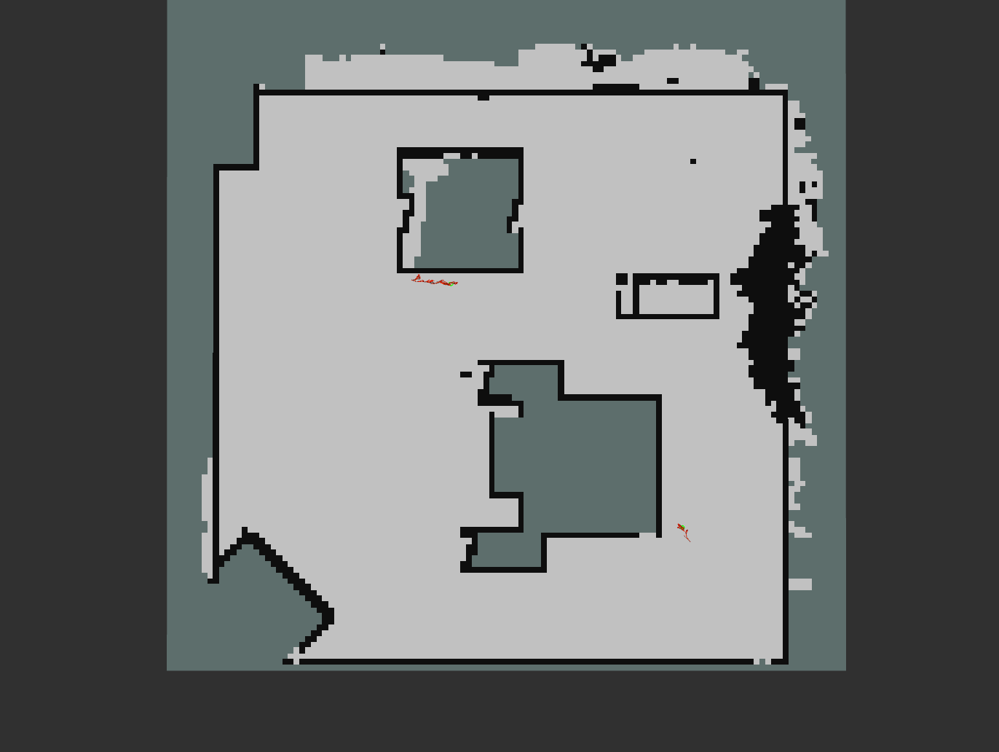
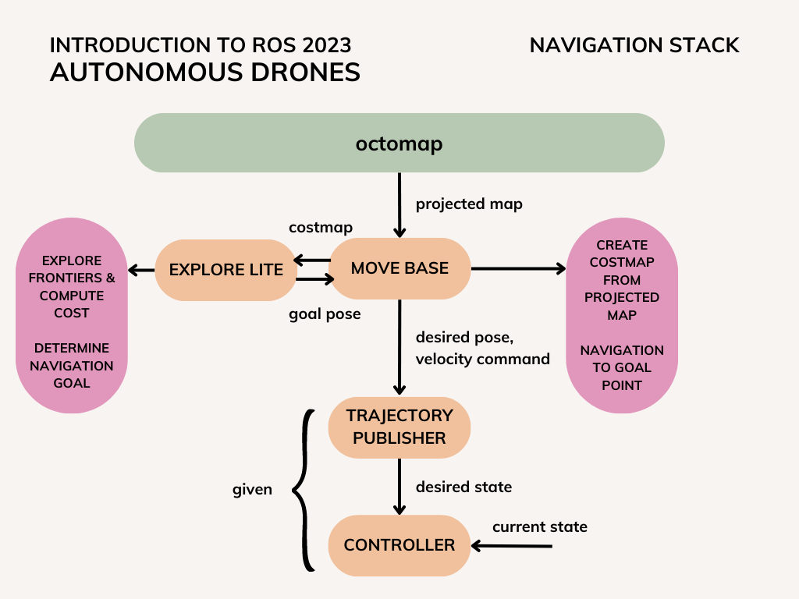
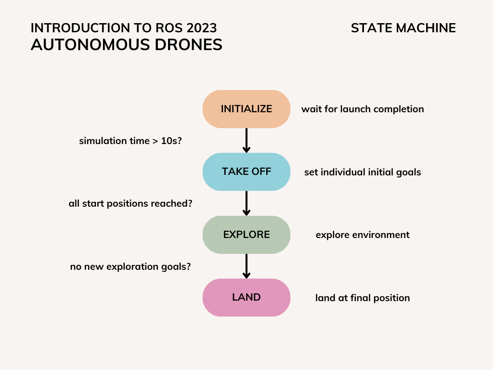

# Documentation

This document provides detailed explanations about important decisions and design choices during the development of the provided code.

## Launch files

The launch files have been set up in way, that makes adding more drones rather easy and therefore potentially scales better in larger environments.

The basic structure of the project is mirrored in the structure of the launch files and can looks like this:



### simulation.launch

At first we launch the built unity files to start the simulation.

```xml
<node name="simulation" pkg="simulation" type="Two_Drones.x86_64"/>
```

To avoid name collisions we can launch and connect to each drone within seperate namespaces by specifying its name as defined in unity and the ports used for communication.

```xml
<group ns="drone_1">
    <include file="$(find simulation)/launch/drone.launch">
        <arg name="name" value="Quadrotor"/>
        <arg name="port_to_unity" value="12346"/>
        <arg name="port_from_unity" value="9998"/>
    </include>
</group>
```

To create and handle the global 3D occupancy grid and the 2D projected map of the environment we need to launch an octomap server.

```xml
<include file="$(find simulation)/launch/global_map.launch"/>
```

The state machine controls the high-level flow of drone behaviour during simulation and provides commands like *take-off*, *explore* and *return* for all drones.

```xml
<include file="$(find state_machine)/launch/state_machine.launch"/>
```

To visualize the 3D occupancy grid and the 2D projected map as well as the drone odometry and footprint we launch rviz with a predefined configuration.

```xml
<node pkg="rviz" type="rviz" name="rviz" args="-d $(find nav_pkg)/rviz/simulation.rviz"/>
```

The transformations between the involved components can be visualized like this:



### drone.launch

To launch a single drone we first need to establish a connection from the Unity simulation to corresponding nodes in ROS.
The correct drone can be found by its predefined name.

```xml
<include file="$(find simulation)/launch/unity_ros.launch">
    <arg name="name" value="$(arg name)"/>
    <arg name="port_from_unity" value="$(arg port_from_unity)"/>
</include>
```

To make navigation and perception slightly more difficult, noise is added to the drone state by the *state_estimator_corruptor*.
The code was slightly tweaked to work for any drone.

```xml
<node pkg="simulation" type="state_estimate_corruptor_node" name="state_estimate_corruptor" output="screen">

    <!-- state topics for individual drones -->
    <param name="true_pose_topic" value="true_pose"/>
    <param name="true_twist_topic" value="true_twist"/>
    <param name="est_pose_topic" value="pose_est"/>
    <param name="est_twist_topic" value="twist_est"/>
    <param name="est_state_topic" value="current_state_est"/>
    <param name="body" value="$(arg name)/body"/>

    <!-- random-walk drift factor (grows with distance traveled) -->
    <param if="$(arg corrupt_state_estimate)" name="drift_rw_factor" value="0.03"/>
    <param unless="$(arg corrupt_state_estimate)" name="drift_rw_factor" value="0.0"/>

    <!-- independent white noise -->
    <param if="$(arg corrupt_state_estimate)" name="pos_white_sig" value="0.005"/>
    <param unless="$(arg corrupt_state_estimate)" name="pos_white_sig" value="0.0"/>

    <!-- average number of seconds between jumps/drift updates -->
    <param if="$(arg corrupt_state_estimate)" name="jump_seconds" value="20.0"/>
    <param unless="$(arg corrupt_state_estimate)" name="jump_seconds" value="-1.0"/>
</node>
```


```xml
<include file="$(find simulation)/launch/move_base.launch">
    <arg name="name" value="$(arg name)"/>
</include>
```

The *depth_image_proc* package uses the depth information of the onboard camera to create a 3D pointcloud.
This pointcloud is then published twice:
- Globally to be used by the octomap package
- Locally within the drone for continuous obstacle avoidance

```xml
<node pkg="nodelet" type="nodelet" name="nodelet_manager" args="manager"/>

<!-- global pointcloud -->
<node pkg="nodelet" type="nodelet" name="depth_image_to_pc" args="load depth_image_proc/point_cloud_xyz nodelet_manager">
    <remap from="camera_info" to="realsense/depth/camera_info"/>
    <remap from="image_rect" to="realsense/depth/image"/>
    <remap from="points" to="/points"/>
</node>

<!-- local pointcloud -->
<node pkg="nodelet" type="nodelet" name="drone_pc" args="load depth_image_proc/point_cloud_xyz nodelet_manager">
    <remap from="camera_info" to="realsense/depth/camera_info"/>
    <remap from="image_rect" to="realsense/depth/image"/>
    <remap from="points" to="points"/>
</node>
```

For correct orientations some transformations between world, drone and onboard camera are necessary.

```xml
<!-- transform between drone and camera -->
<node pkg="tf2_ros" type="static_transform_publisher" name="$(arg name)_to_camera" args="0 0 0 -1.57079632 0 -1.57079632 /$(arg name)/true_body /$(arg name)/Sensors/DepthCamera"/>
```

At last we have to connect ROS back to the Unity simulation in order to send movement commands using a drone-specific topic.

```xml
<node name="w_to_unity" pkg="simulation" type="w_to_unity" output="screen">
    <param name="port_to_unity" type="str" value="$(arg port_to_unity)"/>
    <param name="pose_topic" type="str" value="true_pose"/>
</node>
```

### unity_ros.launch

In order to read from the Unity simulation, we have to connect to the drone using the correct name and port.
Subsequently the information provided by Unity has to be converted to ROS topics.

```xml
<node pkg="simulation" type="unity_ros" name="unity_ros" output="screen">
    <param name="port_from_unity" type="str" value="$(arg port_from_unity)"/>
    <param name="name" type="str" value="$(arg name)/true_body"/>

    <remap from="~$(arg name)/Sensors/IMU/pose" to="true_pose"/>
    <remap from="~$(arg name)/Sensors/IMU/twist" to="true_twist"/>
    <remap from="~$(arg name)/SensorsDepthCamera/image_raw" to="realsense/depth/image"/>
    <remap from="~$(arg name)/SensorsDepthCamera/camera_info" to="realsense/depth/camera_info"/>
</node>
```

### global_map.launch

The package *octomap* provides functionality to not only convert 3D pointclouds to 3D occupancy grids, but also derive 2D projection of the grid, which can be used for navigation.

```xml
<node pkg="octomap_server" type="octomap_server_node" name="octomap_server">
	<param name="frame_id" type="string" value="world"/>
	<param name="resolution" value="1"/>
	<param name="sensor_model/max_range" value="20.0"/>
	<param name="occupancy_min_z" value="1.0"/>
	<param name="occupancy_max_z" value="2.5"/>

	<remap from="cloud_in" to="/points"/>
</node>
```

### move_base.launch

The *move_base* package provides functionality to navigate in an unknown environment based on a continuously updated costmap.
It provides a global planner and a local planner, where both are using a seperate costmap.
The parameters of these costmaps are determined seperately in the provided *yaml* files. 

```xml
<node pkg="move_base" type="move_base" name="move_base" respawn="false">
    <!-- load costmap parameters -->
    <rosparam command="load" ns="global_costmap" file="$(find simulation)/params/costmap_common_params_$(arg name).yaml"/>
    <rosparam command="load" ns="local_costmap" file="$(find simulation)/params/costmap_common_params_$(arg name).yaml"/>
    <rosparam command="load" file="$(find simulation)/params/local_costmap_params_$(arg name).yaml"/>
    <rosparam command="load" file="$(find simulation)/params/global_costmap_params_$(arg name).yaml"/>
    <rosparam command="load" file="$(find simulation)/params/base_local_planner_params.yaml"/>
    <rosparam command="load" file="$(find simulation)/params/global_planner_params.yaml"/>

    <!-- move_base parameters -->
    <param name="base_global_planner" value="navfn/NavfnROS"/>
    <param name="planner_frequency" value="3.0">
    <param name="planner_patience" value="3.0"/>
    <param name="controller_frequency"  value="5.0"/>
</node>
```
The package *explore_lite* is responsible for exploraing the environment by discovering the frontiers on the border of the known map. The *move_base* package is mandatory for its functionality. 

```xml
<node pkg="nav_pkg" type="explore" name="explore" output="screen" respawn="false" launch-prefix="bash -c 'sleep 5.0; $0 $@' ">
    <param name="robot_base_frame" value="$(argname)/body"/>
    <param name="costmap_topic" value="projected_map"/>
    <param name="costmap_updates_topic" value="map_updates"/>
    <param name="visualize" value="true"/>
    <param name="planner_frequency" value="1"/>
    <param name="progress_timeout" value="7"/>
    <param name="potential_scale" value="8"/>
    <param name="orientation_scale" value="0.0">
    <param name="gain_scale" value="0.0"/>
    <param name="transform_tolerance" value="03"/>
    <param name="min_frontier_size" value="0.75"/>
</node>
```
The *move_base* and the *explore* node are launched individually for each drone and thus have their own independent behavior. 

## Perception pipeline

Perception is straight-forward and achieved only using existing ROS packages.
The potentially difficult part around merging can be easily solved by publishing multiple pointclouds to the same topic.



Although some flickering in pointcloud and occupancy grid visualization can be observed the final result is stable and does not contain too much noise.





## Navigation stack

For navigation two ROS packages are used. These are the *move_base* and *explore_lite*. Both packages are staying in close interaction. The exploration consists of following steps:

1.	Determination of all frontiers of the known map.

2.	Calculation of cost values for each frontier based on the distance between the center of the drone and the center of the frontier.
A small distance between the drone and the frontier corresponds to a small cost, whereas a big distance leads to a big cost. Another factor is the size of the frontier.
The bigger the frontier, the cheaper is the corresponding cost.  

3.	Choose the frontier with the minimum cost value. The centroid of this frontier is defined as the goal point for the *move_base* node.

4.	Frontiers on the explored map areas are blacklisted and are not further considered. Blacklisting allows the drone to navigate to undiscovered spaces.
Additionally, if a frontier is unavailable after a certain amount of time, it will also get blacklisted.

5.	Iterate steps from one to four until no frontier can be found.

If a goal is set by *explore_lite*, then the navigation commands are sent to *move_base* to reach the goal.
A user specified tolerance for reaching the goal is defined.
The *move_base* node includes a recovery behavior, which gets activated when the drone perceives itself to be stuck.
One of the recovery mechanisms is the inbuilt *rotate_recovery*, however this method fails in our case.
To improve this issue, an own recovery behavior should be written. 




## State-machine behaviour

The state machine is written in Python and consists of a very straight-forward layout. The states are transitioned to in the following order:

1. In the beginning, when the simulation and all necessary nodes are still launching, the state machine will wait for 10s, until everything is setup.
During this time it will send out its initial state 0 to all drones listening to the topic */state*.
In this *init* state a drone will not generate any trajectories or rotor speed commands and therefore sink to the ground.

2. After the initial waiting time has passed, the state machine will update its internal state and send out the respective information to all drones.
The second state is called *take-off* as the drones will only generate trajectory messages towards the starting position (set in the top-level launch file).
The state machine then waits until the distance of each drone and their respective starting position is small enough before transitioning further.

3. To determine, whether all start positions have been reached, the state machine listens to each drones */true_pose* topic (coming from Unity).
In the third state, the drones are commanded to *explore* the map.
This state will be upheld until there are no more new goals published by the Navigation Stack and the drones reach the last published goals.

4. Lastly the state machine will command all drones to lower their z position, i.e. *land* on the ground.
Again listening to the drones positions, the state machine will finally transition to a non-existing state and by doing so shut itself and the *traj-publisher* of each drone down.
The simulation will keep running, for you to investigate / save the resulting maps to disk, if you wish to do so in a second terminal (```octomap_saver -f mapfile.ot```).

The state machine and its behaviour can be visualized like this:




### State message

To enable an easy one-way communication from the state machine to each drone, we implemented a new *message* type.
The *State* message includes a *Header*, which is currently unused and a simple *uint8* representing the current state.
The states are ordered in the way they are transitioned to and start at 0.

This new message type is located in the same package as the state machine and the corresponding *CMakeLists.txt* and *package.xml* have been modified accordingly.

An important step in creating new *messages* in ROS includes message generation at build and run time, which have to be added explicitly.

### New service call

Unfortunately it was not necessary for this project to implement a new ROS *service* call, since all the heavy-lifting is done by existing packages mostly communicating via *topics*.

It can be noted though, that implementing a new *service* in ROS does not differ a lot from a new *message* and therefore would not have posed a mentionable problem during development.

### Odometry-Node (Not used)

Since the original state of the drone is corrupted with white noise and also an accumulating error over time, the idea was to create an odometry node in which a PT1-Filter was implemented. The source code for the filter is from https://github.com/jimmyberg/LowPassFilter. However, due to the lag while simulating in Unity, it was difficult to find the right time constant for such a filter, many tries led to an even more unstable behavior. This is why, this node was not used in the current setup. 
